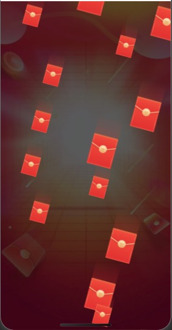

# 示例项目启动
```javascript
npm install

npm run dev
```


# 配置：

| props | 作用 |
| ---- | ---- |
| activityTime | 红包雨活动持续时间(默认10s) |
| speed | 红包雨下落速度（默认6，数值越大下落速度越快）|

- 基于css3动画实现，流畅度和兼容性都还不错，兼容大部分场景。 
- 可拷贝到uni-app项目使用

# 效果展示：




